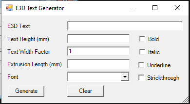

# E3DTextGenerator

E3DTextGenerator used to create a AVEVA PML DBListing for 3D Letters of required sentence in any font and size. Once the DBListing is Created, It can be run as macro on by selecting any `FRMW` Element.

If it's required to add more fonts in the application, [ExtrusionInfo.xml](./E3DTextGenerator/E3DTextGenerator/ExtrusionInfo.xml) File must be updated Accordingly.

More information about the form is mentioned below,

- **E3D Text**: Write the Sentence which will converted to DBListing.

- **Text Height**: Overall Height of the 3D Text in `mm`.

- **Text Width Factor**: It's a factor proportional to character to character distance within sentence.

- **Extrusion Length**: Extrusion Length of the characters within the sentence in `mm`.

- **Font**: Fonts are appering from[ExtrusionInfo.xml](./E3DTextGenerator/E3DTextGenerator/ExtrusionInfo.xml) file. Select the font in which the 3D sentense required to be formed.

- **Bold** : Check if Bold Sentence required.

- **Italic** : Check if Italic Sentence required.

- **Underline** : Check if Underline Sentence required.

- **Strickthrough** : Check if Strickthrough Sentence required.

Once the appropriate data feed in the form, Generate button will Create a file and ask for a path to store the DBListing/ Macro File.
